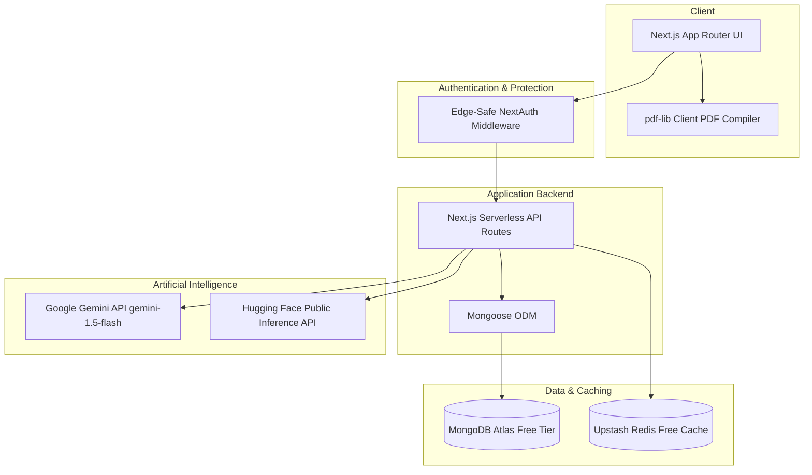
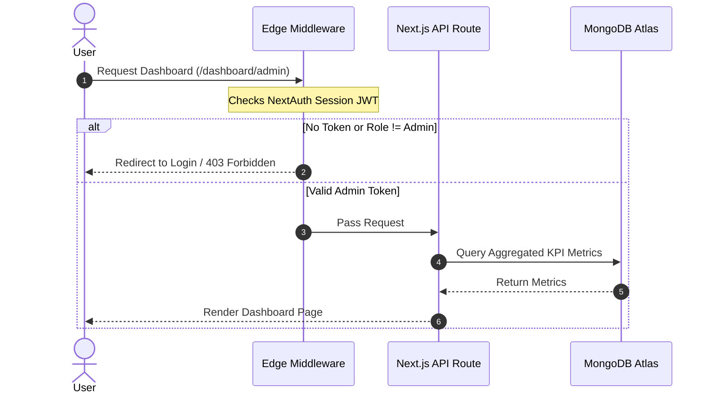

# 🚀 FWC SmartHR - AI-Powered Human Resource Management System

**Developed by: Mohammed Aazam**

FWC SmartHR is a premium, fully-featured AI-Powered Human Resource Management System (HRMS) built for a hackathon. The system is designed to run entirely on a **100% Free Stack** with no credit cards required, leveraging permanent free tiers for database, cache, storage, and AI processing.

---

## 🏗️ The 100% Free Stack & Architecture

FWC SmartHR is designed as a serverless Next.js application, maintaining a minimal resource footprint with high speed and zero cost.



### Stack Components:
1. **Frontend & Backend**: Next.js 14 (App Router) + TypeScript + TailwindCSS + Lucide Icons.
2. **Database**: MongoDB Atlas Free Tier (512MB M0 Cluster).
3. **Caching**: Upstash Redis Free Tier (10,000 requests/day) for caching admin dashboard stats (5-minute TTL).
4. **AI Services**:
   - **Google Gemini API** (`gemini-1.5-flash` model, 15 req/min free tier) for Chatbot intent classification, Resume screening, and Performance review drafting.
   - **Hugging Face Inference API** (using public models) for sentiment analysis aggregation on employee pulses.
5. **Storage**: Cloudinary Free Tier (25GB) for resume PDFs and profile photo uploads.
6. **Authentication**: NextAuth.js v5 with credentials provider. The middleware runs on the Vercel Edge Runtime and checks JWT roles in-memory, completely bypassing Mongoose to avoid Edge compatibility crashes.
7. **Client-Side PDF Compiler**: Powered by `pdf-lib` to generate and compile official payslips directly inside the browser, eliminating server-side CPU overhead and timeout issues.

---

## 🔒 Edge-Safe Role Authentication Workflow

To enforce the 4 roles (`admin`, `senior_manager`, `hr_recruiter`, `employee`) securely, NextAuth encodes roles in a JWT. The Edge middleware decodes the token and enforces routing restrictions instantly at the network boundary.



---

## 🛠️ Installation & Setup

### 1. Prerequisites
- **Node.js** (v18.x or v20.x recommended)
- A **MongoDB Atlas** database (free cluster)
- An **Upstash Redis** database (free instance)
- A **Google Gemini API Key** (free from Google AI Studio)
- A **Cloudinary** cloud name (for file uploads)

### 2. Configure Environment Variables
Create a `.env.local` file in the root of the project:

```env
# MongoDB Atlas Database Connection
MONGODB_URI=mongodb+srv://<username>:<password>@cluster0.xxxxx.mongodb.net/fwc_smarthr?retryWrites=true&w=majority

# NextAuth Configuration
NEXTAUTH_SECRET=a_very_long_random_string_here_at_least_thirty_two_chars

# Upstash Redis Configuration
UPSTASH_REDIS_REST_URL=https://xxxx.upstash.io
UPSTASH_REDIS_REST_TOKEN=your_upstash_token_here

# Google Gemini API Key
GEMINI_API_KEY=your_gemini_api_key_here

# Hugging Face API Token (Optional, falls back to mock if empty)
HUGGINGFACE_API_TOKEN=your_huggingface_api_token_here

# Cloudinary Storage Configuration
NEXT_PUBLIC_CLOUDINARY_CLOUD_NAME=your_cloudinary_cloud_name
```

### 3. Install Dependencies
```bash
npm install
```

### 4. Run Database Seeding
Execute the database seeder to populate the database with 200 users, 30 days of attendance, active job postings, candidates, leave records, payrolls, and sentiment data:

```bash
npx.cmd tsx scripts/seed.ts
```

### 5. Start Development Server
```bash
npm run dev
```
Open [http://localhost:3000](http://localhost:3000) in your browser.

---

## 👥 Role-Based Test Credentials

The seeder creates accounts with specific roles. Use these credentials to test dashboard routing:

| Name | Role | Email | Password |
| :--- | :--- | :--- | :--- |
| **FWC Admin** | `admin` | `admin@fwc.com` | `admin123` |
| **John Doe** | `senior_manager` | `manager1@fwc.com` | `manager123` |
| **Alice Johnson** | `hr_recruiter` | `hr1@fwc.com` | `hr123` |
| **Employee 1** | `employee` | `employee1@fwc.com` | `employee123` |

---

## 🌟 Key Features

1. **Dashboard Analytics (Admin/Manager/HR)**: Custom dashboards showing headcount breakdowns, average ratings, attendance rates, and AI strategy insights generated via Gemini.
2. **Interactive Org Chart**: Dynamic recursive tree structure displaying the management hierarchy.
3. **Scalable Employee Directory**: List virtualized with `react-window` to support smooth scrolling for 100+ items.
4. **Attendance Tracker**: Check-in/out stamps with automatic late flag calculations, monthly calendars, and admin overrides.
5. **AI Resume Screener**: Extracts text from PDF resumes inside Next.js using `pdf-parse`, prompt-engineers Gemini for scoring, and updates candidate tables.
6. **Smart HR Chatbot**: Context-aware floating assistant parsing employee intent to answer database queries about leaves, colleagues, and attendance.
7. **Client-Side PDF Payslips**: Instant A4-size PDF creation using `pdf-lib` without any server workload.
8. **Pulse Feedback Aggregation**: Hugging Face-powered sentiment analysis tracking company morale trends.
